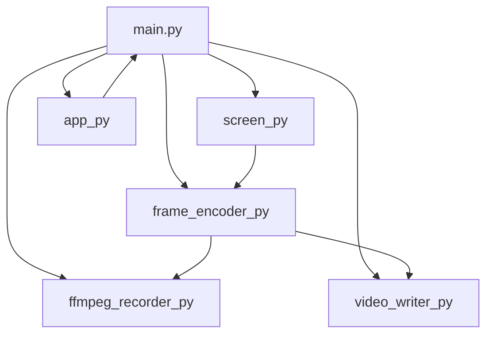

# Projeto: screen-streamer

## Contexto
Projeto para captura, transmissão e gravação de tela, com arquitetura modular baseada em Python. Utiliza OpenSpec para especificação e rastreabilidade de mudanças.

## Visão Geral da Arquitetura

- **main.py**: Ponto de entrada da aplicação.
- **capture/**: Módulo responsável pela captura de tela.
  - `screen.py`: Implementação da captura de tela.
- **client/**: Cliente para consumo do stream (detalhes a definir).
- **encoder/**: Codificação de frames capturados.
  - `frame_encoder.py`: Codifica frames para transmissão ou gravação.
- **recorder/**: Gravação de vídeo e manipulação de arquivos.
  - `ffmpeg_recorder.py`: Gravação utilizando FFmpeg.
  - `video_writer.py`: Escrita de arquivos de vídeo.
- **transport/**: Camada de transporte para envio/recebimento de dados (detalhes a definir).
- **ui/**: Interface de usuário.
  - `app.py`: Interface gráfica ou CLI.
- **utils/**: Utilitários e funções auxiliares.
- **test/**: Testes automatizados e scripts de validação.
- **openspec/**: Especificações, mudanças e configuração do OpenSpec.
  - `config.yaml`: Configuração do OpenSpec.
  - `changes/`, `specs/`, `archive/`: Diretórios para rastreio de mudanças e specs.

## Padrões OpenSpec
- Todas as mudanças relevantes devem ser documentadas em `openspec/changes/`.
- Especificações de arquitetura e requisitos ficam em `openspec/specs/`.
- Mudanças concluídas são arquivadas em `openspec/archive/`.
- O arquivo `openspec/config.yaml` define contexto, regras e padrões do projeto.

## Convenções
- Modularização por domínio.
- Testes em `test/`.
- Utilização de virtualenv para dependências Python.
- Documentação e rastreabilidade via OpenSpec.

## Diagrama Simplificado

## Observações
- Ajuste e detalhe os módulos conforme a evolução do projeto.
- Utilize o OpenSpec para propor, rastrear e documentar mudanças na arquitetura.
